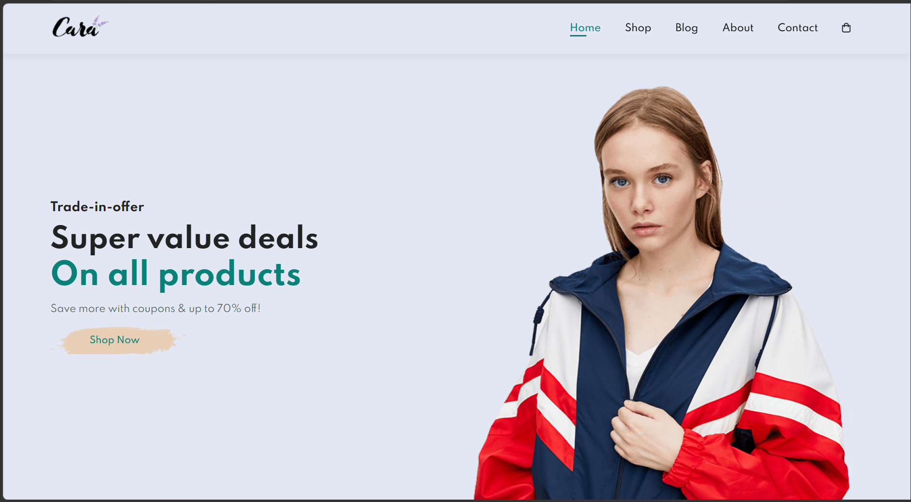
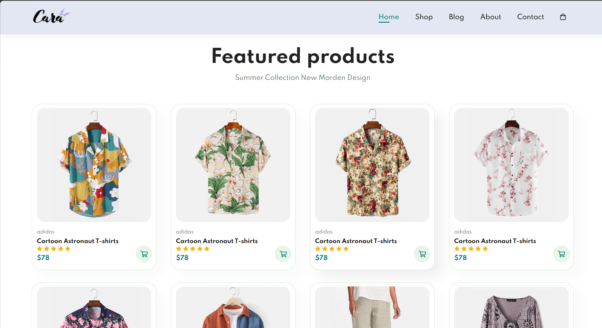
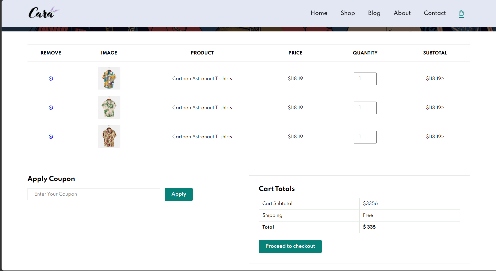
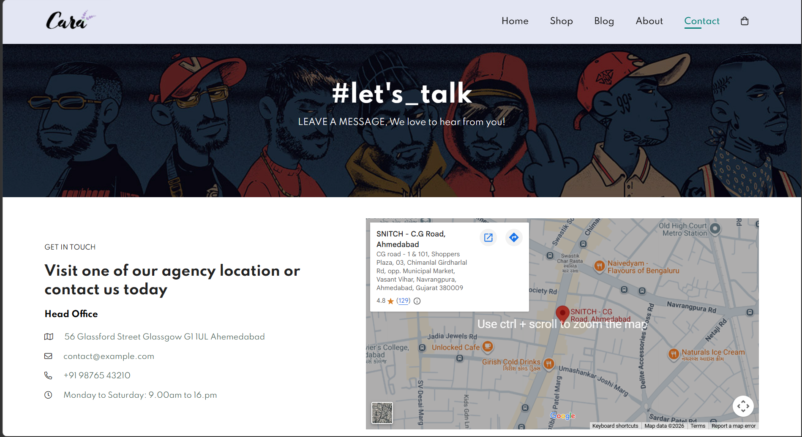
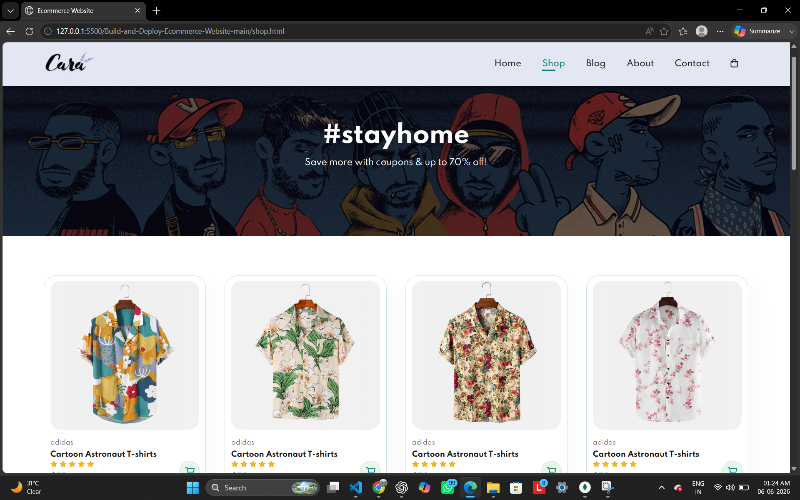

# 🛍️ Cara Fashion Store

A modern and responsive Fashion E-Commerce Website built using HTML, CSS, JavaScript, Node.js, Express.js, and MongoDB.

The project provides a complete online shopping experience where users can browse products, explore fashion collections, read blogs, contact the store, manage cart items, and place orders through a backend-connected checkout system.

---

## 🌟 Project Overview

Cara Fashion Store is a full-stack fashion e-commerce project designed to simulate a real-world online shopping platform. The website features a responsive user interface, multiple pages, product showcases, shopping cart functionality, and backend order processing with MongoDB integration.

---

## 🚀 Features

### Frontend Features

- Responsive Design
- Mobile Navigation Menu
- Hero Banner Section
- Featured Products
- New Arrival Products
- Promotional Banners
- About Us Page
- Fashion Blog Page
- Contact Page
- Shopping Cart Page
- Newsletter Subscription Form
- Google Maps Integration
- Font Awesome Icons

### Backend Features

- Node.js Server
- Express.js REST API
- MongoDB Database Integration
- Mongoose ODM
- Order Management System
- JSON Data Processing
- Checkout API

---

## 🛠️ Tech Stack

### Frontend

- HTML5
- CSS3
- JavaScript (ES6)
- Font Awesome

### Backend

- Node.js
- Express.js
- MongoDB
- Mongoose
- CORS

### Tools

- VS Code
- Git
- GitHub
- MongoDB Compass

---

## 📂 Project Structure

```text
Cara-Fashion-Store/
│
├── index.html
├── about.html
├── blog.html
├── contact.html
├── cart.html
│
├── style.css
├── script.js
│
├── server.js
│
├── img/
│   ├── products/
│   ├── blog/
│   ├── about/
│   ├── features/
│   ├── pay/
│   └── logo/
│
└── README.md
```

## 📌 Pages Included

### 🏠 Home Page

- Hero Section
- Featured Products
- New Arrivals
- Promotional Offers
- Newsletter Section

### 👤 About Page

- Company Introduction
- Brand Story
- Mobile App Promotion

### 📝 Blog Page

- Fashion Articles
- Style Guides
- Product Information

### 📞 Contact Page

- Contact Form
- Google Maps
- Store Information

### 🛒 Cart Page

- Shopping Cart
- Coupon Section
- Cart Totals
- Checkout Functionality

---

## ⚡ JavaScript Features

- DOM Manipulation
- Event Handling
- Mobile Menu Toggle
- Fetch API
- Dynamic User Interaction
- API Communication

---

## 🗄️ Backend Features

- REST API Development
- MongoDB Database Connectivity
- Order Creation API
- JSON Request Handling
- Express Middleware Usage

---

## 🎯 Problem Solved

This project provides a digital shopping platform that allows customers to browse products, manage cart items, and place orders efficiently through a responsive and user-friendly interface.

---

## 🧠 Challenges Faced

- Frontend and Backend Integration
- MongoDB Database Connection
- REST API Development
- Responsive Design Implementation
- Checkout System Development
- Managing User Interactions

---

## 🔥 Skills Demonstrated

- Frontend Development
- Backend Development
- Responsive Web Design
- API Development
- Database Management
- Problem Solving
- Version Control using Git & GitHub

---

## 📊 Project Statistics

- Pages: 5+
- Technologies Used: 8+
- Backend APIs: 1+
- Database: MongoDB
- Responsive Design: Yes
- Mobile Friendly: Yes

---

## 🔧 Installation Guide

### Clone Repository

```bash
git clone https://github.com/hasantasneem859-byt/model-1-training.git
```

### Move to Project Directory

```bash
cd cara-fashion-store
```

### Install Dependencies

```bash
npm install
```

### Start MongoDB

```bash
mongod
```

### Run Backend Server

```bash
node server.js
```

MongoDB Connection:

```text
mongodb://localhost:27017/ecommerce
```

Server will run on:

```text
http://localhost:5000
```

### Open Frontend

Open:

```text
index.html
```

in your browser.

---

## 📸 Screenshots

### Home Page



### Featured Products



### Cart Page



### Contact Page



### Shop page



---

## 🚀 Future Improvements

- User Authentication
- Login & Registration System
- Product Search Functionality
- Product Filtering
- Wishlist Feature
- Payment Gateway Integration
- Razorpay Integration
- Order Tracking
- Product Reviews & Ratings
- Admin Dashboard

---

## 📚 Learning Outcomes

Through this project I learned:

- HTML5 Structure
- Advanced CSS Styling
- Responsive Design
- JavaScript DOM Manipulation
- Fetch API Usage
- Node.js Development
- Express.js Framework
- MongoDB Database Management
- REST API Development
- Git & GitHub Workflow

---

## 🏅 Resume Description

Developed a responsive full-stack fashion e-commerce website using HTML, CSS, JavaScript, Node.js, Express.js, and MongoDB. Implemented shopping cart functionality, REST APIs, responsive design principles, and backend order management system to simulate a real-world online shopping platform.

---

## 👨‍💻 Author

### Tasneem Hasan

B.Tech Computer Science Engineering Student

GitHub: https://github.com/hasantasneem859-byt

---

## ⭐ Project Status

Completed and Ready for:

- Internship Applications
- GitHub Portfolio
- Resume Projects
- Academic Submission

---

### If you like this project, don't forget to give it a ⭐ on GitHub!