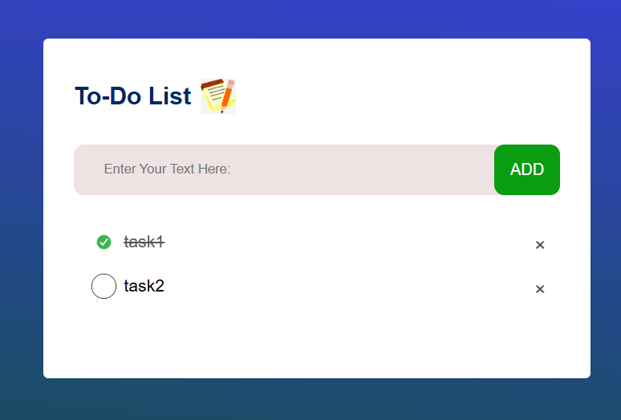

# 📝 To-Do List Application

## 📌 Project Overview

A simple and interactive To-Do List Application built using HTML, CSS, and JavaScript.

This application helps users manage daily tasks efficiently by allowing them to add, complete, and delete tasks. All tasks are stored in Local Storage, so data remains available even after refreshing the page.

---

## 🚀 Features

- Add New Tasks
- Mark Tasks as Completed
- Delete Tasks
- Local Storage Support
- Responsive Design
- Interactive User Interface

---

## 🛠️ Technologies Used

- HTML5
- CSS3
- JavaScript (ES6)
- DOM Manipulation
- Local Storage API
- Git & GitHub

---

## 📸 Project Screenshot




## 📂 Project Structure

```text
To-Do-List/
│
├── index.html
├── style.css
├── script.js
│
├── images/
│   ├── notes.png
│   ├── checked.png
│   └── uncheck.png
│
└── README.md
```

## 💡 How It Works

1. User enters a task in the input field.
2. Clicks the ADD button.
3. A new task is created dynamically.
4. Clicking a task marks it as completed.
5. Clicking the × icon removes the task.
6. Tasks are saved in Local Storage.
7. Saved tasks remain available after page refresh.

---

## 🧠 JavaScript Concepts Used

- getElementById()
- createElement()
- appendChild()
- addEventListener()
- classList.toggle()
- localStorage.setItem()
- localStorage.getItem()
- Event Delegation
- DOM Manipulation

---

## 📚 Learning Outcomes

Through this project I learned:

- DOM Manipulation
- Event Handling
- Dynamic Element Creation
- Local Storage Management
- Responsive CSS Design
- JavaScript Fundamentals
- Git & GitHub Workflow

---

## 🔧 Installation

Clone the repository:

```bash
git clone https://github.com/hasantasneem859-byt/model-1-training/tree/9b906cdd2738e90f4989edbd308c93781faebed6/model1-2401031800050/project1-To-do-list%20application
```

Open project folder:

```bash
cd todo-list
```

Run:

```text
Open index.html in your browser
```

---

## 🎯 Future Improvements

- Edit Task Feature
- Dark Mode
- Due Date Feature
- Search Tasks
- Task Categories
- Drag & Drop Sorting

---

## 👨‍💻 Author

Tasneem Hasan

B.Tech Computer Science Engineering Student

---

## ⭐ Project Status

Completed and Ready for GitHub Portfolio.